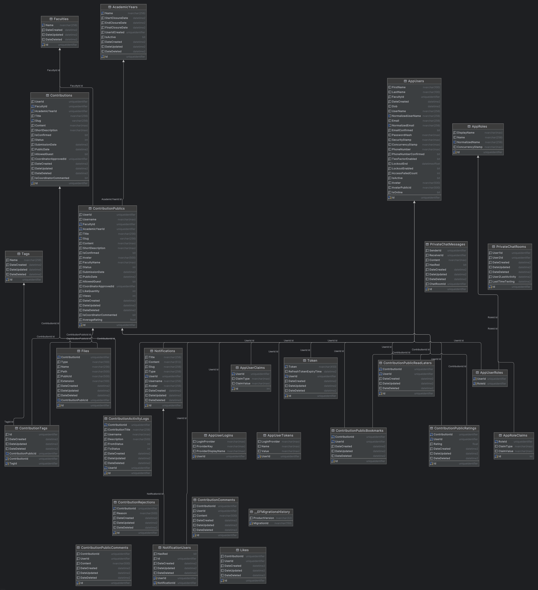

# 📖 UMCS - University Magazine Contribution System

---

## 🌟 Context

The **University Magazine Contribution System (UMCS)** streamlines the submission, review, and publication process for a large university’s annual magazine. Built using agile scrum practices, University Students, Faculty Marketing Coordinators, University Marketing Manager, Guest, and Admin in a collaborative ecosystem.

---

## 🛠️ Features

### 🏢 Admins
- Manage Academic Year.
- Manage Faculties.
- Manage Contributions.
- Manage User and User's Roles.
- Role-based access control (RBAC).
- Manage Report Stats.

### 👥 Marketing Coordinators
- Manage Contribution (Approve or Reject contribution).
- Manage guest permissions to view specific public contribution.
- Manage Guest Accounts.
- View Faculty report stats.

### 🖋️ Students
- Submit documents (.docx, .pdf) and high-quality images.
- Agree to Terms and Conditions.
- Update submissions until the final closure date.
- Receive feedback notifications.

### 📊 Marketing Manager
- View selected contributions (read-only).
- Download selections as a ZIP file post-final closure.
- Access statistical analysis.

### 👤 Guest
- View allowed contribution (read-only).

---

## ⚙️ Tech Stack

- **Backend**:
    - ASP.NET Core 8, Entity Framework Core (main system).
    - SignalR (real-time applications).
- **Database**: 
    - Microsoft SQL Server (transactional data, analytics and reporting).
    - Redis (caching and session management).
- **Frontend**: NextJS, TypeScript, SASS, Style-Components.

---

## 🏛️ Architecture

- **Clean Architecture**: Organizes code into modular layers (Domain, Application, Infrastructure) to enhance maintainability and simplify unit testing.
- **CQRS Pattern**: Divides write operations from read operations for optimized performance and scalability.
- **Repository Pattern**: Encapsulates data access logic into reusable, testable repositories, abstracting the underlying database.
- **Unit of Work**: Coordinates multiple repository operations into a single transaction, ensuring data consistency across changes.
- **Cron Job**: Schedules recurring tasks, such as checking for contributions without comments after 14 days and triggering exception reports.
- **JWT Token**: Secures API endpoints with JSON Web Tokens, enforcing role-based access via authentication and authorization.
- **Event-Driven Design**: Guarantees reliable email notifications to Marketing Coordinators using an outbox pattern with RabbitMQ for asynchronous event handling.
- **.NET Core Web API**: Delivers lightweight, RESTful endpoints with ASP.NET Core 8, maximizing efficiency and client compatibility.

---

## 📊 Relational Database

---

## 📂 Project Repositories

- Backend: [UMCS_BACKEND](https://github.com/pphatt/enterprise-web-software-development)
- Frontend: [UMCS_FRONTEND_WEB](https://github.com/pphatt/UMCS_FRONTEND_WEB)

---

## 🤝 Contributors

A huge thanks to our developer for making UMCS a reality!

| Name         | GitHub Username                     | Role                               |
|--------------|-------------------------------------|------------------------------------|
| Vu Tien Phat | [pphatt](https://github.com/pphatt) | Project Lead, FullStack  Developer |

